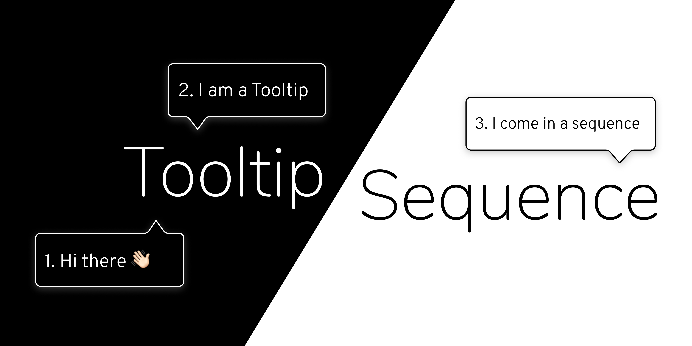
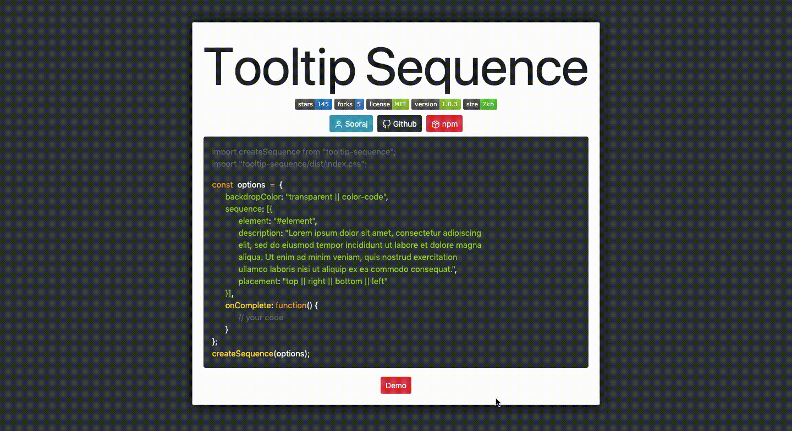

# Tooltip Sequence
A minimalistic set of tooltips on your app.

<div style="width: 100%; display: flex; justify-content: center; align-items: center;">
  <a href="https://github.com/SoorajSNBlaze333/tooltip-sequence/stargazers"></a>
  <a href="https://github.com/SoorajSNBlaze333/tooltip-sequence/network"></a>
  <a href="https://github.com/SoorajSNBlaze333/tooltip-sequence/issues"></a>
  <a href="#"></a>
</div>





## What it does
So suppose you create a Web Application and you want to take your users or anyone on a walkthrough on one, two or maybe all the features in your app, you can install this simple Javascript package to create a sequence of small tooltips that will guide the user to each feature( in our case a web element ) and show a small description of what you want them to know about that feature.This package would save you the time to manually create tooltip descriptions on each page and link them together in action.

## Installation

<h3 style="font-weight: 100;">Quick Usage ⚡️</h3>
<div style="font-size: 12px; font-weight: 200;">Add the following tags to your HTML document</div>

```html
<link rel="stylesheet" href="https://unpkg.com/tooltip-sequence@latest/dist/index.css">
<script src="https://unpkg.com/tooltip-sequence@latest/dist/index.min.js"></script>
```

<h3 style="font-weight: 100;">Or</h3>

<h3 style="font-weight: 100;">Use npm</h3>

```sh
npm install tooltip-sequence --save
```

<div style="font-size: 12px; font-weight: 200;">Add the following statements to the file that uses the sequence</div>

```js
import createSequence from "tooltip-sequence";
import "tooltip-sequence/dist/index.css";
```

## Example

```js
const options = {
  backdropColor:"transparent || color-code",
  sequence:[{
    element:"#element",
    description:"Lorem ipsum dolor sit amet, consectetur adipiscing elit, sed do eiusmod tempor incididunt ut labore et dolore magna aliqua. Ut enim ad minim veniam, quis nostrud exercitation ullamco laboris nisi ut aliquip ex ea commodo consequat.",
    placement:"top || right || bottom || left"
  }],
  onComplete:function() {
    // your code
  }
};
createSequence(options);
```
<div style="font-weight: 200;">Infinite Customizations available. You can customize any element that is created by overriding the classes. Customizations are only limited by the creativity of the designer</div>

<h2 style="margin-top: 10px; font-weight: 200;">Checkout the features and a live demo <a href="https://tooltip-sequence.netlify.app/">here</a></h2>


## Development

You need [Hugo](https://gohugo.io/) to run the dev server. If you have [Homebrew](https://brew.sh/) you can do the following:

```sh
brew install hugo
```

Check this [Hugo installation page](https://gohugo.io/getting-started/installing/) for installing on other systems.

Then clone the repo, install dependencies, and start the server locally.

```sh
git clone https://github.com/SoorajSNBlaze333/tooltip-sequence.git
cd tooltip-sequence
npm i
npm start
```

Open [`http://localhost:1313`](http://localhost:1313) in your browser.

| Scripts              | Description                          |
| -------------------- | ------------------------------------ |
| `npm start`          | Starts a local dev server            |
| `npm run production` | For generating production docs files |
